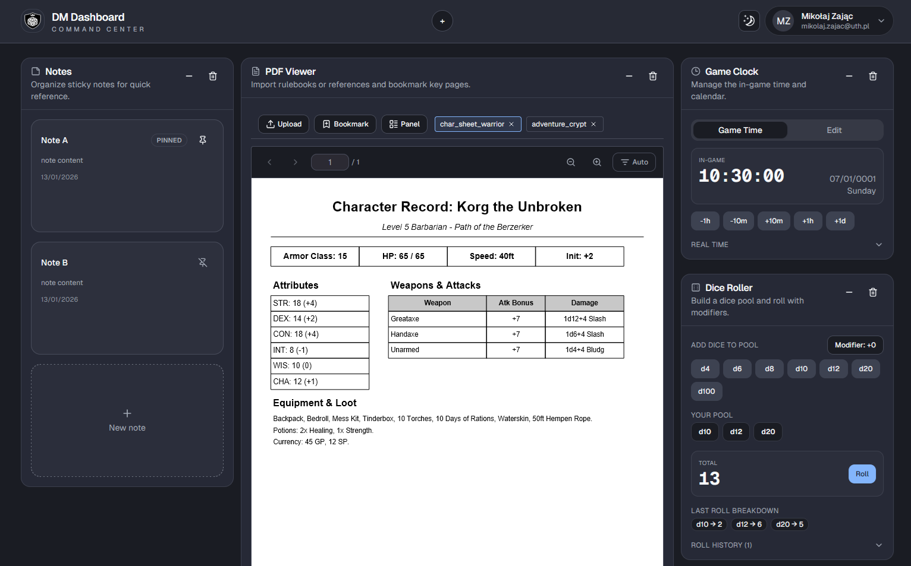
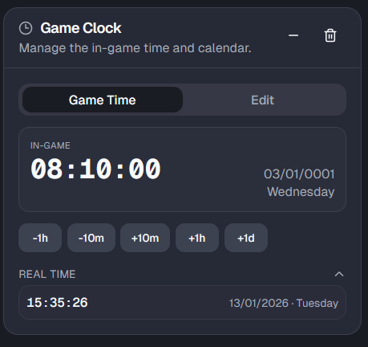
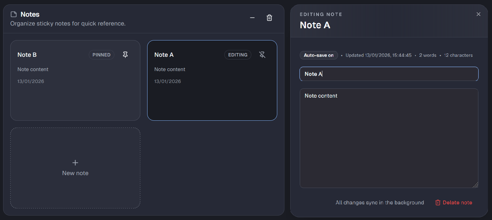
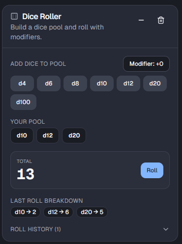
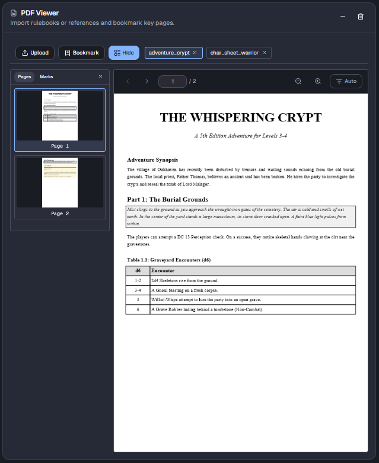

# DM Helper

DM Helper is a web-based dashboard for Tabletop RPG (TTRPG) Game Masters.

It provides a widget-driven workspace to track in-game time, organize session notes, roll dice, and reference PDFs in one place with per-user persisted state.

## Features

- **Widget dashboard** with draggable, per-user widget instances
- **Game Clock** to track in-world date, time, and weekday
- **Notes** with pinning and ordering for session prep
- **Dice Roller** with roll history logs
- **PDF Viewer** with tabs, bookmarks, and reading state
- **Authenticated user workspaces** (Google OAuth + credentials)

## Tech Stack

- **Frontend:** Next.js 15 (App Router), React 19, Tailwind CSS
- **API:** tRPC (type-safe end-to-end)
- **Database:** Prisma ORM + SQLite
- **Auth:** NextAuth.js
- **Monorepo:** pnpm workspaces + Turborepo

## Repository Structure

```text
apps/
  webapp/          # Next.js app
packages/
  api/             # tRPC routers and appRouter
  auth/            # NextAuth configuration
  db/              # Prisma schema, client, seed
  env/             # Typed environment validation
  ui/              # Shared UI components
  validators/      # Shared Zod validators
  modal/           # Modal utilities
tooling/
  eslint/
  prettier/
  tailwind/
  typescript/
```

## Getting Started

### 1) Prerequisites

- Node.js **20+**
- pnpm **9+**

### 2) Install dependencies

```bash
pnpm install
```

### 3) Configure environment

Create a `.env` file in the repo root:

```env
DATABASE_URL="file:./packages/db/prisma/dev.db"
PREFIX="@"
GOOGLE_CLIENT_ID="your-google-client-id"
GOOGLE_CLIENT_SECRET="your-google-client-secret"
NEXTAUTH_SECRET="replace-with-a-long-random-secret"
NEXTAUTH_URL="http://localhost:3000"
NEXT_PUBLIC_PDF_WORKER_SRC="/pdf.worker.min.mjs"
```

> Notes:
> - `GOOGLE_CLIENT_ID` / `GOOGLE_CLIENT_SECRET` are required by the current auth config.
> - `NEXTAUTH_SECRET` should be a strong random value.

### 4) Push schema and generate Prisma client

```bash
pnpm --filter @repo/db run db:push
pnpm --filter @repo/db run db:generate
```

### 5) Run the app

```bash
pnpm dev:webapp
```

Open `http://localhost:3000`.

## Developer Commands

From the repository root:

```bash
pnpm dev            # Run workspace dev tasks in parallel
pnpm dev:webapp     # Run only the webapp
pnpm typecheck      # Type-check all packages/apps
pnpm lint           # Lint all packages/apps
pnpm format         # Check formatting
pnpm build          # Build all packages/apps
```

Database helpers:

```bash
pnpm --filter @repo/db run db:studio
pnpm --filter @repo/db run db:seed
```

## Architecture Notes

- Main API entrypoint: `packages/api/src/root.ts`
- Widget state and data are scoped per authenticated user
- Current widget types:
  - `game-clock`
  - `notes`
  - `dice-roller`
  - `pdf-viewer`

## Screenshots

| Dashboard | Game Clock |
|---|---|
| <br/><sub>Main GM workspace showing the widget-based dashboard layout and session controls.</sub> | <br/><sub>Tracks in-world date, weekday, and time to keep campaign pacing consistent.</sub> |

| Notes | Dice Roller |
|---|---|
| <br/><sub>Session note management with quick capture, ordering, and pinning for priority information.</sub> | <br/><sub>Integrated dice rolling with stored roll history for transparent outcomes during play.</sub> |

| PDF Viewer |
|---|
| <br/><sub>In-app rules reference with tabbed documents and bookmarks for fast lookup.</sub> |

## Documentation

- The engineering thesis is currently unpublished and is not linked in this public repository.

## License

Licensed under the MIT License. See `LICENSE`.
